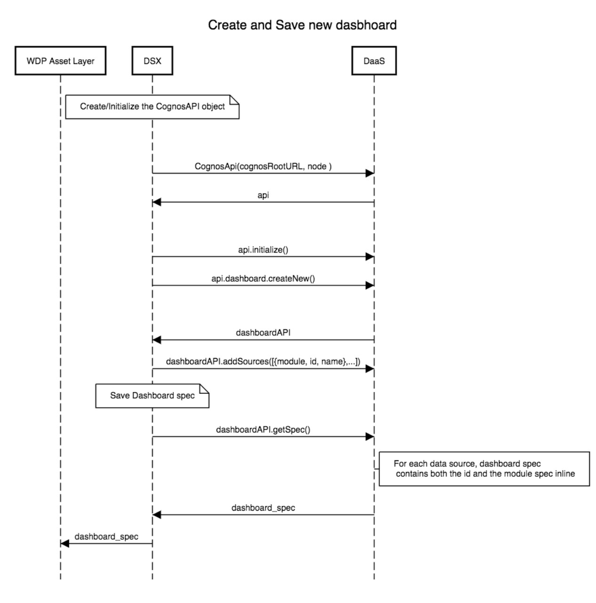

---

copyright:
  years: 2018
lastupdated: "2018-01-19"
---

{:new_window: target="_blank"}
{:shortdesc: .shortdesc}
{:screen: .screen}
{:codeblock: .codeblock}
{:pre: .pre}

# Providing Application users with the ability to create their own dashboard assets

If you want to allow your users of their applications to be able to explore the data from their applications by creating and editing their own dashboards, then do the next steps:
1.	In your application, allow the user to create a new dashboard with the *dashboard.createNew()* method. Alternatively, the dashboard can be created with the *dashboard.openDashboard()* method with a starter dashboard specification that, for example, already has the application's data sources added to it. If you start with an existing starter dashboard specification, then use the *dashboardAPI.setMode* method, to put the dashboard into edit mode as follows:
	```bash
	dashboardAPI.MODES.EDIT
	```    
	{: pre}
2.	When the user performs a save dashboard action in the embedding application, then your app should use the *dashboardAPI.getSpec()* method to get a specification of the dashboard in its current edited state. The embedding application should store this specification to allow it to be reopened later by the users. To open a saved dashboard, use the *dashboard.openDashboard()* method. 
3.	You can code the embedding application to register for an event to tell it when the dashboard changed and would need saving by using the *dashboardAPI.on(dashboardAPI.EVENTS.DIRTY, window.onDirty)* event. This allows the embedding application to show an indicator that the dashboard has changes since the last save, and to ask if the dashboard must be saved, when the user closes it. The dirty state can be reset by using the *dashboardAPI.clearDirty()* method.

**Note:** Persistence of dashboards in the {{site.data.keyword.dynamdashbemb_full}} service itself does not exist. It is the responsibility of the embedding application to persist dashboard specifications, by using the pattern described in this section, as required. This allows the dashboard persisted assets to be stored and managed with the rest of the embedding application’s assets, for more consistency overall in the application.

Example flow of how to create and save a new dashboard:


