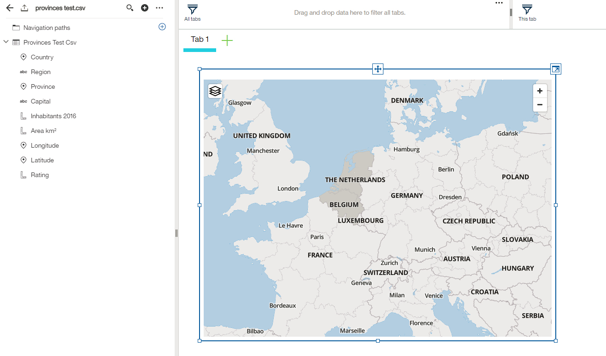

---

copyright:
  years: 2018
lastupdated: "2018-01-19"
---

{:new_window: target="_blank"}
{:shortdesc: .shortdesc}
{:screen: .screen}
{:codeblock: .codeblock}
{:pre: .pre}

# Overview of {{site.data.keyword.dynamdashbemb_short}}

{{site.data.keyword.dynamdashbemb_full}} provides developers the ability to embed an interactive dashboard with visualizations into their offering.

Virtually every application today has lots of data that can be used to enhance the application user’s insights into the domain of the application. To tap into this value and provide it to their users, the application developer needs to provide a means of showing this raw data through analytics and visualizations.

Whether providing a guided exploration of the analysis through authored fixed dashboards, or providing a more free-form analytic exploration environment to allow their users to find their own insights, {{site.data.keyword.dynamdashbemb_short}} provides application developers with a way to add these analytic capabilities to their application.

Adding {{site.data.keyword.dynamdashbemb_short}} into an application involves four steps:
1. Creating an {{site.data.keyword.cloud}} account and provisioning a {{site.data.keyword.dynamdashbemb_short}} service instance.
2. Creating a service credential to access the service instance API.
3. Creating a {{site.data.keyword.dynamdashbemb_short}} session from your web service application.
4. Adding {{site.data.keyword.dynamdashbemb_short}} into your web client application through the {{site.data.keyword.dynamdashbemb_short}} JavaScript API.

For more information, see [Getting started tutorial](/docs/services/dynamic-dashboard-embedded/dde_getting_started.html).

{:shortdesc}

